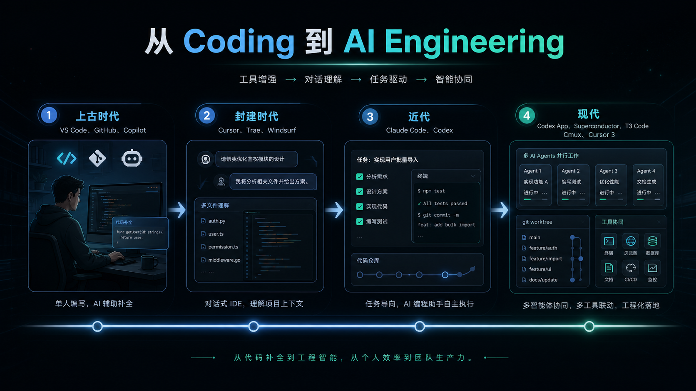
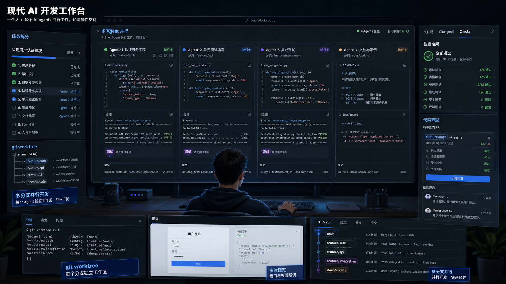
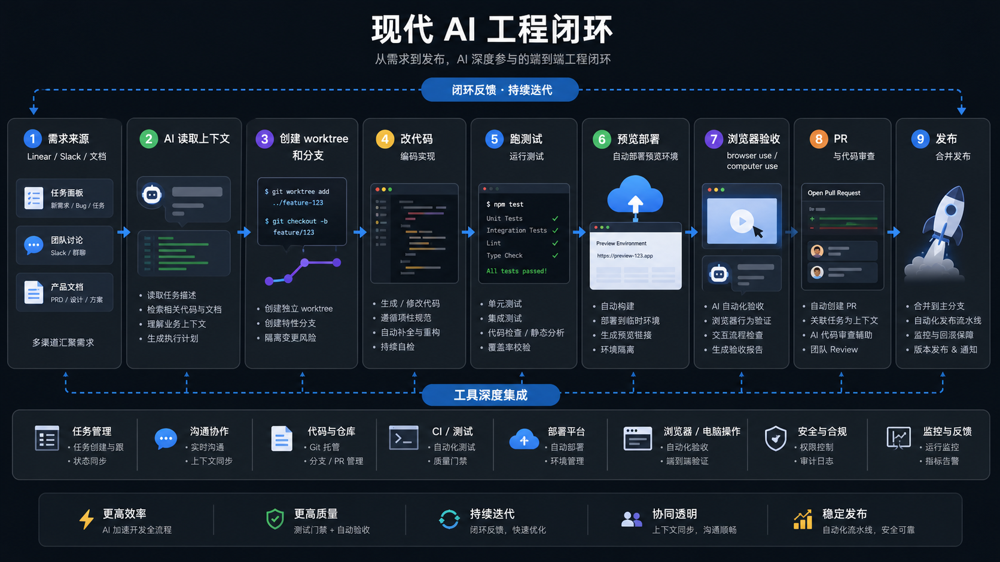
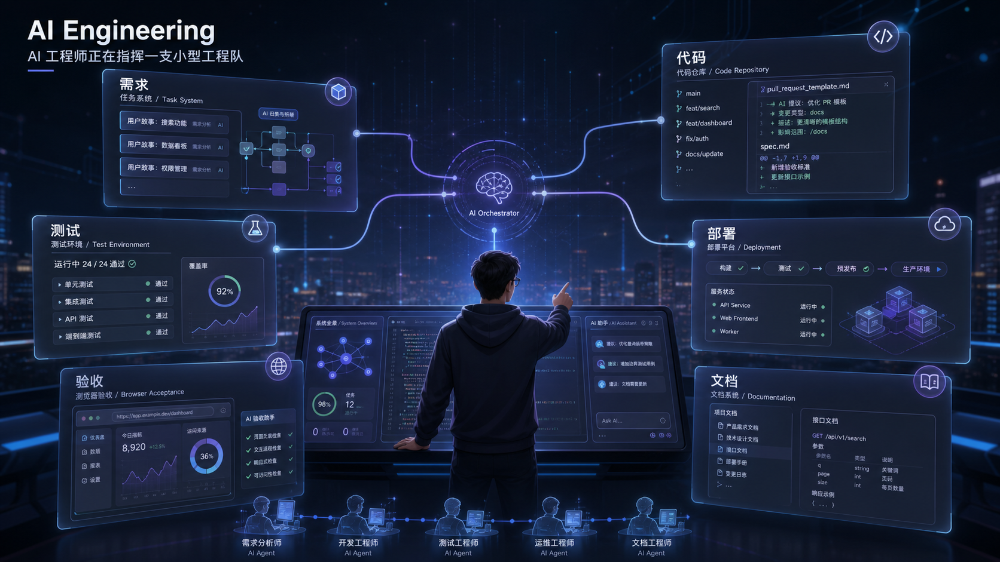

## AI 时代的软件构建：从 Vibe Coding 到 AGENTIC Engineering

过去十几年，软件开发的主线很清楚：更好的编辑器，更顺手的协作平台，更自动化的流水线。开发者打开 VS Code，写代码，跑测试，提交到 GitHub，等待 Code Review，再进入 CI 和部署。这个过程稳定、清晰，也塑造了现代工程师的工作习惯。

AI 出现后，变化开始沿着另一个方向发生。它最初像一个更聪明的补全器，帮我们补齐函数、生成样板代码、写测试。随后它进入编辑器，开始理解项目结构。再后来，它进入终端、云端沙箱、Issue、Pull Request、部署预览，开始承担完整任务。今天，AI 已经能串联 Linear、Slack、GitHub、测试环境、浏览器、部署平台和监控系统。它不再只是一个会回答问题的模型，而是逐渐成为一个深度参与软件交付的工程系统。

## **上古时代**：编码入口被打开，但上下文的空洞依然存在

VS Code、GitHub 和 Copilot，构成了技术叙事中的“**上古时代**”基础设施。

VS Code 改变了本地开发体验。它将编辑、调试、插件、终端和语言服务整合，使程序员工作流程统一顺畅。GitHub 重塑了协作方式。代码成为可讨论、审查、追踪、自动化测试和持续交付的社会化资产。Copilot 第一次将 AI 大规模融入核心编码动作。

这一代工具解决了实际难题。面对空白文件不再手足无措；重复代码不再消耗时间。API 调用、类型定义、测试样板、配置文件都能更快生成。开发者可以将更多精力投入设计和调试，而不是被机械输入困扰。

但它们的边界也很清楚。Copilot 式补全主要围绕当前文件、当前函数、当前光标附近的语境展开。它擅长“顺着你正在写的东西往下写”。但要它真正理解产品设计深层原因，或跨越几十个文件完成完整功能，则非常困难。它可以敲出一段代码，却很难回答“这个功能到底需要改动哪几层？”“这样做会不会破坏现有权限模型？”或“这个变更对计费、日志、测试、灰度会产生什么影响？”这样的复杂问题。

所以，**上古时代**的核心成就，在于极大提升了个人编码速度。但它的核心局限，也恰恰在于上下文理解太浅。它将开发者从部分重复劳动中解放出来，但深层次的工程判断、任务拆分、跨文件修改，以及质量保证，依然由人类承担。

这个阶段的 AI，更像一盏贴近光标的小巧聚光灯。它能精准照亮局部，让手边的代码更容易写出来。但它无法照亮整个系统。它知道你正在写什么代码，却未必能理解这个模块存在的意义。它能帮你补齐一段函数，却难以洞悉产品从需求萌芽到最终交付的完整路径。

## **封建时代**：当编辑器化身为对话式工作台

Cursor、Trae、Windsurf，这些工具的出现，标志着 AI 在编程领域的角色发生飞跃。AI 不再是光标旁的代码补全助手。它成为编辑器里的全能协作者。这些工具的共通之处在于：AI 不再满足于补齐一行代码，而是能围绕整个项目与你对话。它能检索文件，修改多个文件，解释复杂错误，并提出整套实现方案。

这一阶段的演变意义深远。它第一次将“对话”推到开发的入口。以前写代码，需要先知道打开哪个文件，再思考如何修改。现在可以直接描述目标，让 AI 找出相关模块，解释调用链，甚至构思改动方案。开发者的起手式，从“定位代码”变为“描述意图”。

这种转变带来新鲜感，也伴随一丝危险的轻盈。你随口一句“帮我实现登录后的会员权益页”，AI 可能真的创建页面，补上接口调用，生成状态处理逻辑，甚至考虑错误文案。它像一个熟悉框架的初级工程师，手脚麻利，乐于尝试。

然而，即便身处这个**封建时代**，这些工具也面临挑战。

首先是**长程上下文**的挑战。项目越大，AI 越容易在细微之处和不成文约定上出错。它可能改好页面，却遗漏重要埋点；接口调用漂亮，却忘了接入权限校验；修复一个 bug，却引入新的边界问题。这就像一个人在迷宫里，只顾眼前路，却忘了整个迷宫布局。

接着是**工程集成**的困境。在真实开发项目里，有 lint 检查、类型系统、测试用例、构建流程、环境变量、数据库迁移、灰度发布、日志规范。这些是工程的血肉。AI 固然能写代码，但它不天然理解这些工程约束。它或许能生成看似正确的实现，但未必懂得团队为何这样组织目录，为何某个接口必须幂等，为何某个错误不能直接暴露给用户。这些是代码背后的人情世故。

还有**多人协作**的复杂性。一个 AI agent 在本地分支上改代码，这相对简单。但当多个开发者、多个 agent、多个需求同时推进时，冲突、代码审查、合并、回滚都会变得异常复杂。传统 Git 分支尚能承载协作重担，但 AI 高并发的产出能力，无疑增加分支管理压力。

尽管如此，**封建时代**的价值不容忽视。它让“AI 编程”第一次具备产品形态，从概念走向现实。但它也清晰揭示一个事实：仅仅把 AI 塞进编辑器还不够。AI 若想真正融入工程实践，任务环境、执行环境、协作环境和审查环境需要同步变革。这就像为一艘强大的新船，打造一个全新的港口生态。

## 编程助手的进化：从建议到执行

Claude Code 和 Codex 的出现，标志着编程助手迈入新阶段。它们不再停留在编辑器内的辅助，而是开始**面向任务执行**。

这意味着 AI 编程助手正向“接手任务”的方向演进。它不再只是补全函数，而是能承担一个完整 Issue：修复导出失败 bug，补齐支付回调幂等逻辑，重构组件，增加单元测试，或评估迁移风险。它会读取项目上下文，提出解决方案，修改代码，运行命令，最后将成果递交审查。

这一阶段的核心突破，在于 AI 获得了**行动能力**。这种行动力体现在三个方面：理解项目来龙去脉，灵活调用工具完成任务，以及对产出进行初步自检。模型本身的强大是基石，但真正让体验脱胎换骨的，是模型、工具、环境和流程的协同。

能力越大，责任和风险也随之升级。任务型 Agent 一旦拥有运行命令、修改文件、操作 Git 的权限，其潜在风险远超简单代码补全。它可能误删文件，对环境产生错误理解，甚至生成看似合理却难以维护的架构。更麻烦的是，它还会遇到平台兼容性问题：本地开发环境与云端环境差异，私有依赖安装失败，数据库连接受限，测试数据缺失，以及权限不足。AI 越深入工程实践，就越需要严谨的工程化约束。

所以，**近代阶段**的主题是：**AI 开始真正动手做事，而人类的角色，则从纯粹的代码编写者，转变为任务的设计师、成果的审查者和风险的控制者。** 这拔高了人类开发者工作的重心。目光不再聚焦于代码书写，而是更宏观地思考：任务如何拆解？权限如何分配？产出如何验证？失败如何优雅回滚？这是一个充满挑战也充满机遇的时代。

## 现代AI开发的核心：把一个人变成一支小型工程队

进入现代阶段，Codex App、Superconductor、T3 Code、Cmux、Cursor 3 等工具出现。它们拓宽了思考维度。我们不再只纠结于“一个Agent能否独立完成任务”。我们更深入探讨“多个Agent如何协同工作”、“怎样有效隔离上下文”、“如何对比不同方案的优劣”，以及“如何将AI产出融入团队工程实践”。

一个更贴近真实的工作场景是这样的：开发者面前是一个统一工作台。左侧展示Git分支和变更记录，中央是多个Agent的活跃会话，右侧集成文件树、测试面板、运行反馈和提交入口。每个Agent都像一位临时工程伙伴，各司其职，负责明确任务。人类开发者站在枢纽，负责擘画目标、分配任务、检查成果、合并代码，并掌控风险。

这种工作流的核心转变在于，我们不再将AI视为“自动补全”工具。更恰当的视角，是将其视为一组可灵活调度的执行单元。一个Agent专注于解读需求文档，另一个修改核心代码，再一个可能忙于补充测试用例。还有Agent扮演审查者角色，或深入文档、查找历史约定。人类开发者无需亲手敲代码，但必须把握方向。我们可以让AI跑得快，但不能让它脱缰狂奔。

通常，现代开发的第一步是厘清工程边界。例如，在项目根目录放置`AGENTS.md`、`CLAUDE.md`、`README.md`、`OpenSpec`这类规范文件。它们是给AI的“项目说明书”。里面详细阐述项目结构、技术栈、包管理方式、测试命令、提交规范、安全边界、命名规则、目录职责，以及哪些文件是不能随意改动的“禁区”。

过去，这些信息通过老员工口头传授。现在，我们需要将其沉淀为AI能理解的文本。若缺少明确指引，Agent只能依靠猜测工作。演示阶段，猜测可能效率惊人。但在真实工程实践中，它极易埋下隐患。

接下来，我们需要将需求拆解成可执行的小任务。现代AI开发中，最怕将笼统的话直接抛给Agent。例如，“帮我把整个会员系统做完”。这样的任务范围太大，AI容易迷失方向，开发者也难以有效审查。更明智的做法是，将任务细分为几个清晰单元：首先，读取现有账号模块和权限模块；接着，设计会员状态字段；然后，实现后端接口；再编写前端页面；补充测试；最后，检查埋点和错误处理，并生成变更说明。

每个任务都应有明确输入、输出和验收标准。AI擅长执行明确指令，但它不能替你承担目标模糊带来的责任。

再进一步，为每个任务开辟独立“工作空间”至关重要。`git worktree`的价值便凸显出来。传统开发模式中，许多人习惯在同一仓库里切换分支，频繁stash和恢复环境。当AI加入后，这种方式会变得一团糟。你可能同时让三四个Agent在不同方向尝试，如果它们都在同一目录下修改文件，冲突解决将异常棘手。

`worktree`的妙处在于，同一仓库可衍生出多个独立目录。每个目录对应一个分支，每个Agent在自己的“专属领地”里工作。如此一来，一个Agent专注于修复支付问题，另一个修改前端交互，还有一个补充测试，它们互不干扰。最终，你只需比较每个分支差异，决定哪些内容值得合并到主线。

我们发现，让**Agent先读，再写**，是一个更稳妥的策略。许多AI工作流失败，并非模型能力不足，而是它一上来就急于修改代码。现代开发中，一个更稳健的流程是先让Agent进行“代码侦察”。你可以要求它首先回答：这个功能会涉及哪些目录？核心入口在哪里？已有的模式是什么？哪些测试可能受影响？哪些文件是不能触碰的？然后，让它提交一个简短的实现计划。只有当计划合理时，才允许它进入真正的修改阶段。

这个步骤能显著降低随意修改的风险。它也让开发者在代码真正被触动之前，就能判断AI是否理解了项目。

接下来，可将实现任务交给一个主Agent，同时安排旁路Agent进行检查。例如，你要修改一个“项目技术选型”的OpenSpec变更。主Agent负责完成文档和任务文件，而旁路Agent专注于审查：有没有违反OpenSpec结构？是否遗漏了`proposal.md`、`tasks.md`、`design.md`？有没有破坏已有约定？是否引入了不必要的架构变更？

这类旁路审查非常有用。AI产出速度越快，人类审查压力越大。让另一个Agent先行进行一轮机械检查，能把许多低级问题挡在前面。这样，当人类开发者查看最终差异时，注意力就能更集中于设计质量和产品判断。

第六步，要求Agent在每次修改后提供验证结果。现代AI开发不能只听它一句“改好了”。你需要让它明确运行了哪些命令，以及这些命令的输出是什么。例如，`pnpm lint`是否通过，`pnpm test`是否通过，类型检查是否通过，OpenSpec校验是否通过，构建是否通过。如果有些命令没有运行，原因是什么？如果测试失败，是原有失败还是本次改动导致？

这里有个重要习惯：我们不满足于结论，更要看具体命令和结果。Agent的自然语言总结可能天衣无缝，但工程结果必须由实际运行的命令证明。

第七步，用差异（diff）进行人工审查。AI完成修改后，开发者切勿急于提交。首先，检查文件数量，看看是否修改了不该动的文件；接着，深入核心文件，判断实现是否与现有结构一致；再查看测试文件，确认测试是否覆盖了本次变更；最后，审阅生成的文档，避免为了完成任务而写出空泛描述。

现代工具通常将“Files”、“Changes”、“Checks”整合在一起。这正是为了让开发者在一个界面内完成这些工作。AI可以生成代码，但最终进入代码仓库的，必须是经过人类严格审查的代码。

第八步，将AI工作产物写回工程系统。例如，本次任务对应一个OpenSpec变更，那么就要让它更新`tasks.md`的完成状态；如果修改了接口，需要更新接口说明；如果新增了行为，要补充测试说明；如果存在迁移风险，则需写入变更备注。过去许多工程团队的文档滞后，往往因为编写文档耗时耗力。现在，AI能够承担大部分文档整理工作，开发者要做的，就是定义标准并检查其真实性。文档不应仅仅是“看起来很完整”的摆设，它应该精准反映系统的真实状态。

第九步，在提交前进行一次清理和归档。AI工作流中，容易产生大量中间信息：计划、解释、失败尝试、临时文件、重复注释。提交前，我们可以让Agent帮助清理无关改动，但这一步需要格外谨慎。可以先让它列出准备清理的内容，并说明清理安全性，然后再执行。提交信息也可以让Agent生成，但人类必须将其修改为清晰的工程语言。一个好的commit message应该清楚说明修改了什么、为什么修改、以及影响范围。它不是写给机器看的，它是写给未来的自己和团队看的。

最后一步，是将多个Agent的结果合并成一个稳定版本。并行开发的优势在于探索速度快，但代价是选择更多。你可能得到三个看起来都能运行的实现方案。现代开发者的价值，恰恰体现在这里：你需要判断哪个方案更贴合项目结构，哪个方案长期维护成本更低，哪个方案测试更完善，哪个方案引入的新概念最少。AI可以为你提供更多可能性，但它不会自动替你做出正确的工程取舍。最终合并到主分支的，不一定是代码最多的方案，也不一定是看起来最炫酷的方案，而应该是最能融入现有系统的方案。

## 现代AI工程队正在和真实工具链深度连接

现代 AI 开发正在发生根本性变化：Agent 不再只局限于代码仓库，它们开始与公司内部的真实工具链深度融合。

过去的开发流程是人驱动的。产品经理在 Linear 创建需求，运营或用户在 Slack 反馈问题，设计师在 Figma 更新页面，工程师在 GitHub Issue 记录 Bug。开发者需要在这些工具间频繁切换：查看 Linear、Slack 聊天记录、文档，打开本地代码，启动开发环境，提交 PR，等待测试结果，部署预览版，最后在 Slack 或 Linear 同步进展。

AI 涉足工程领域后，这条链路开始被重编。一个成熟的 Agent 工作流，不只是在仓库写代码。它应该能从 Linear 领取任务，理解 Issue 背景，在 Slack 检索讨论。它会找到设计稿或产品文档，然后才在代码仓库中定位修改点。修改完成后，它能创建独立分支，启动测试环境，部署预览版。它甚至能像人一样检查页面，运行自动化测试，最后将结果写回 Linear 或 GitHub PR。

这意味着，AI 开发的边界正从“代码文件”延伸到更广阔的“工作流系统”。

设想一个任务场景：Linear 里有一个 ticket：“新用户注册后，会员权益页没有展示默认套餐”。Agent 拿到 ticket 后，会提取关键信息：问题发生在注册后，涉及会员权益页、用户初始化、套餐默认值、前端展示和后端接口。接着，它会去 Slack 查找类似反馈。然后，它打开代码库，在注册流程、会员状态初始化逻辑和权益页渲染逻辑之间穿梭。此刻，它不再是盲目猜测，而是在真实工具链中收集上下文。

下一步，它会在自己的 `git worktree` 里创建一个独立分支。这样做的好处是主工作区保持干净，其他 Agent 也能并行处理任务。它会修改后端初始化逻辑，补齐默认套餐状态；调整前端空状态处理，并补上测试用例。实现完成后，它会运行 `lint`、类型检查、单元测试和相关集成测试。如果项目配置了预览部署，它还会触发一次临时环境部署。

此刻，`browser use` 和 `computer use` 的价值显现。传统 AI Coding 很多时候停留在“代码看起来写好了”。但真实产品开发需要看运行结果。Agent 可以像用户一样，打开预览环境，走完注册流程：输入邮箱，完成注册，进入权益页。它会检查默认套餐是否展示，按钮是否可点击，空状态是否消失，接口返回数据是否正确。它甚至能截图，读取页面文本，比对预期与实际结果。对于前端开发，这一步至关重要，因为很多问题单凭代码 diff 无法发现。

`computer use` 更进一步，让 Agent 拥有操作完整图形界面的能力。它可以打开本地应用，点击按钮，填写表单，切换页面，查看控制台报错，甚至打开开发者工具。在特定场景下，它能操作第三方后台。这让 AI 从“代码作者”更接近“测试同事”和“产品验收同事”。当然，必须强调权限边界，不能让 Agent 随意操作生产后台、真实支付、真实用户数据和不可回滚的配置。这是底线。

在**深度工具集成**之后，现代 AI 开发呈现出小型工程队的精悍面貌。

Linear 是任务入口。Slack 是团队集体记忆和问题现场。GitHub 是代码协作中心。CI 扮演质量检查员。部署平台是临时实验室。浏览器和 `computer use` 是最终验收环境。Agent 在这些系统间穿梭，将原本需要人反复搬运的信息串联起来。人类开发者则负责判断任务价值、方案合理性、权限安全性以及最终结果是否可合并。

这与早期“让 AI 写一个函数”的工作方式完全不同。早期的 AI 编码，更像一个聪明的助手。而现代 AI Engineering，更像指挥一支精锐的临时工程队：有人从 Linear 领取任务，有人翻阅 Slack 了解背景，有人写代码，有人跑测试，有人部署预览版，还有人在浏览器里验收。每个环节虽仍需人类监督，但信息流和执行流已被大幅压缩，效率显著提升。

这里最重要的不是“AI 会不会调用更多工具”，而是“工具之间能不能形成闭环”。

如果 Agent 只会读 Linear，却不懂得把结果写回去，它只是多了一个输入源。如果它只会部署 preview，却不打开浏览器验证，那也只是多了一次自动发布。如果它只会跑测试，却无法解释失败原因，人类仍需大量后期处理。真正有价值的深度连接，是让任务从萌芽到完成，形成一条清晰可追踪的路径：任务来源一目了然，改动分支清清楚楚，测试结果明明白白，预览地址触手可及，验收记录有凭有据，PR 说明言简意赅，即使失败，原因也清晰可查。

这正是现代 AI 工程平台与普通 AI 编辑器之间的本质区别。普通编辑器主要提升代码生成效率。现代 AI 工程平台则致力于提升整个工程链路的吞吐量。它关心的不再是某段代码写得有多快，而是从需求提出到验证、合并、发布，中间有多少摩擦可以消除，有多少低价值沟通可以自动化，有多少关键上下文信息能够被系统妥善保存。

然而，这种深度连接也伴随着新的风险。

首先是**权限过大**的风险。Agent 能够读写 Slack、Linear、GitHub、部署平台乃至浏览器环境，其权限几乎等同于真实员工。这意味着它可能接触敏感讨论、内部需求、用户反馈、密钥配置、测试账号和业务数据。因此，权限必须严格按任务授予，遵循最小权限原则。只需要读取 ticket，就绝不赋予管理权限；能部署测试环境，就不要给生产发布权限；能访问假数据，就不要触碰真实用户数据。

其次是**上下文污染**的风险。Slack 充斥噪音，Linear 需求可能不完整，历史讨论可能过时。如果 Agent 不加分辨地将所有信息视为事实，很容易做出错误判断。成熟系统需要让 Agent 标注信息来源：结论来自哪条 ticket，哪个 Slack 讨论，哪个文档，还是哪个代码文件？这样，人类审查时才能判断它是否误读了上下文。

第三个风险是**自动验收的幻觉**。`Browser use` 可以点击页面，`computer use` 可以操作界面，但这不等于它真的理解产品体验。它或许能确认页面没有报错，却不一定能判断交互是否流畅；它能确认按钮存在，却不一定能判断文案是否准确；它能走完既定路径，却不一定能判断商业逻辑是否成立。因此，自动验收更适合检查明确标准，如页面元素、接口返回、跳转路径、错误提示、视觉回归、表单提交等。对于产品判断、体验判断和业务取舍，人类依然不可或缺。

第四个风险是，**流程被自动化后反而变得更难观察**。以前，人一步步做事，虽然慢，但每个动作都留下清晰印记。Agent 一口气读任务、改代码、部署、验收、写 PR，如果中间日志不够清晰，人类反而更难知道它做了什么。所以，现代 AI 工具必须高度重视过程记录：它读了哪些文件，调用了哪些工具，运行了哪些命令，部署到哪个环境，浏览器验收走了哪些路径，失败后又修改了什么？

这也是为什么未来的 AI Engineering Platform 必须具备强大的“**可观察性**”。不只是线上系统要可观察，Agent 的行为同样要可观察。你需要能够清晰地看到它的任务计划。

## AI Coding Agent正在从补全器成长为工程流程参与者

AI Coding Agent 的演进，分为几个层次。它像剥洋葱一样，逐渐触及更深的核心。

最基础的一层是 **Code Completion**。它解决的是手速与思维速度的匹配。Copilot 的行内建议，像默契搭档，自动填补重复、模式化的代码。它减少了繁琐重复劳动，加快了局部实现过程。我们因此能更专注于核心逻辑。

再往上是 **Code Editing**。AI 不再只补全代码，它开始理解并修改函数、文件，甚至关联文件。Cursor、Windsurf、Trae 是这个阶段的先行者。我们用自然语言告诉 AI 意图，然后审视它给出的修改（diff 界面），决定是否采纳。这是一种更深层次的协作。

接下来是 **Task Agent** 的崛起。Claude Code、Codex、GitHub Copilot cloud agent 致力于完成整个任务。它们能像初级工程师一样，研究代码库，制定实现计划，在新分支上修改代码。最终决策权仍在我们手中。我们需要审查成果，迭代，直到满意，再创建 Pull Request。

最终愿景是构建一个完整的 **Engineering Platform**。Agent 不再只是写代码的工具，它深度融入整个工程流程。这包括需求分析、项目管理、测试、部署、文档撰写、安全检查，甚至监控。这个阶段有几个核心概念：MCP、Skills、Harness、Subagents、Pipeline。它们共同构筑宏大图景。

**MCP (Multi-Contextual Processor)** 让 Agent 突破代码库边界，连接到更广阔的外部世界。对工程 Agent 来说，代码是冰山一角。真正的任务需要它触及需求文档、设计稿、实时监控数据、数据库结构、Issue 状态、用户反馈，甚至日志和部署系统。MCP 像给 AI 装上眼睛和耳朵，让它在受控环境下读取丰富信息。它也让零散的工具调用变得标准化、可靠。

**Skills** 将团队经验沉淀为可复用模块。一个 Skill 可以打包指令、资源和可选脚本。这样 Agent 能更可靠地执行特定工作流程。团队经验，如“如何编写高质量 API 测试”、“如何自动生成发布说明”、“如何进行安全审查”，甚至“如何严格按照公司组件规范开发前端”，都可以沉淀给 Agent。Agent 不再需要每次从头解释，它能像有经验的同事一样，按部就班完成任务。

**Harness** 提供受控执行环境。好的 Harness 不只是将模型连接到 shell。它需要管理上下文，确保权限得当，监控命令执行，处理错误恢复，记录详尽日志，并考虑成本控制、审查点和终止条件。没有 Harness，Agent 容易成为权限过大的“脱缰野马”。有了它，Agent 才能被稳妥纳入工程体系，可控且安全。

**Subagents** 体现分工协作的智慧。主 Agent 负责理解整体需求并协调工作。主 Agent 之下，多个子 Agent 各司其职：有的专注于实现核心功能，有的负责编写和运行测试，有的专门进行代码审查，有的专注于撰写文档，有的负责进行迁移检查。这像一个微型工程团队：有人负责开发，有人负责质量，有人负责规范，有人负责产品说明，有人负责排查风险。它们共享目标，但各自拥有独立的上下文和明确的任务边界。

当所有能力组合起来，AI Coding Agent 不再是“会写代码的聊天机器人”。它成为工程流程中不可或缺的参与者：它能读懂需求，拆解任务，研究代码，编写实现，跑测试，自动生成 PR。它甚至能解释潜在风险，补充文档，为发布做准备。人类工程师的工作也随之转变：我们不再逐行输入代码，而是将重心放在定义清晰目标、设定合理约束、检查 Agent 成果，以及维护系统健康和一致性上。这是一场工程范式的变革。

## 工具的演进：一场永无止境的迭代

工具像生命体，不断新陈代谢。每次更新都回应前一代问题，也催生新的挑战。

回顾这条演进路径：

Copilot 曾以局部编码效率引人注目。但很快，它在项目整体上下文理解上的短板暴露。于是，Cursor、Windsurf、Trae 等工具出现，试图将 AI 触角延伸到整个项目语境，让 AI 不再是孤立的补全工具。

当 AI IDE 解决了编辑器内的上下文问题，仅理解上下文还不够，任务实际执行能力捉襟见肘。这时，Claude Code、Codex 登场，让 AI agent 能读文件、跑命令、修改代码、提交 PR，将 AI 能力推向更深层次的自动化。

单任务 agent 解决了特定任务执行问题，却凸显多任务管理的复杂性。于是，Codex App、Superconductor、Cmux、Cursor 3 等工具开始出现。它们强调并行 agent、worktree、云端环境、统一工作区和 agent 管理，试图提供更全面、高效的协作平台。

并行 agent 提升了探索效率，但也带来了质量控制、权限管理、成本控制和技能复用等难题。这使得 MCP、Skills、Subagents、Harness 这些概念和工具日益重要，旨在为 AI 驱动的开发流程提供精细化管理和支持。

**深度工具集成**弥补了上下文割裂，但也抛出了权限、审计、环境隔离和自动验收等挑战。未来的工程平台，不能仅停留在“连接”工具层面。它必须同时具备强大的连接能力和严密的控制能力。连接工具不够，还需要它能限制权限、记录过程、追踪来源、复现结果，甚至支持回滚。

工具演进背后，有几个稳定且强大的驱动力：

首先，是**用户痛点**。开发者渴望减少重复工作，避免频繁上下文切换，摆脱环境配置，少一些低价值排错，产出更多可靠成果。这是一个朴素且真实的需求。

其次，是**技术瓶颈**。模型的上下文窗口大小、推理能力、工具调用方式、长任务稳定性、延迟和成本，都是无形边界，决定着工具形态演变。模型对长上下文理解越强，工具越能从简单代码补全走向复杂任务执行；模型调用工具越稳定，agent 才能真正融入日常开发流程。

再者，是**工程复杂度**。现代应用不再是简单的前后端。它是一个庞大的生态系统，涵盖账号、计费、权限、内容、推荐、AI 调用、日志、风控、监控、合规、灰度、增长实验等。如果 AI 要深度参与构建，它必须理解这套复杂系统。仅靠单点代码补全无法满足需求，工程平台化才是大势所趋。

也不能忽视**团队协作**的重要性。一个人用 AI 写 demo 轻松，但团队持续维护产品，用 AI 辅助开发，难度可想而知。真正的挑战在于如何保持代码风格一致性、架构边界稳定性、测试覆盖可靠性、PR 审核可行性、部署可控性以及事故可追溯性。AI 工具最终要服务于整个团队，而非满足个人一时兴奋感。

最后，是**组织效率**。许多工程消耗并非发生在写代码本身。它更多体现在信息转移、状态同步、问题复现、测试验证、环境部署和上线沟通这些环节。如果现代 AI 工具仅能提升代码生成速度，收益很快触及天花板。只有当它能够连接任务、讨论、代码、测试、部署和验收的各个环节，才能真正提高整个交付流程效率。这才是追求的目标。

## 未来的应用构建工具会成为可控的AI工程平台

AI 应用构建工具的发展，将沿着几个方向展开。

**无缝协作：AI Agent融入工作流的每一个角落**

AI agent 将不再是孤立工具，而是团队成员。它们将穿梭于 Issue、PR、设计稿、文档、监控系统和项目管理工具之间。开发者无需频繁切换窗口搬运上下文。Agent 在权限范围内，主动读取所需材料，让协作更流畅。

**全栈 Agent：从代码到产品，AI团队的雏形**

今天的许多 agent 擅长代码生成，但在产品、设计、数据、运维和安全领域理解不足。未来的工具将更像多角色团队。产品 agent 厘清需求，架构 agent 勾勒设计，开发 agent 实现设想，测试 agent 验证成果，安全 agent 检查风险，发布 agent 准备上线。这不再是单一工具的智能，而是协作智能的涌现。

**低延迟与低成本：智能调度，让AI工程更持久**

要让 AI 工程长期可用，不能每次都依赖昂贵耗时的大模型。未来的平台将重视多模型的智能调度。简单任务交给小巧高效模型；复杂设计动用强大模型；代码审查由专门模型把关；检索和索引使用经济实惠模型。成本将成为工程架构的考量因素。

**可复用技能模块：团队经验的沉淀与复用**

“技能”将像团队内部工具库一样重要。成熟团队会积累独有的“测试技能”、“迁移技能”、“文档技能”、“组件规范技能”、“安全审查技能”。这些技能不只是代码片段，更是团队经验的结晶。它们减少重复提示工程，让 AI 产出更贴近组织内部标准，更具团队特色。

**工程化可控：让AI的每一步都有迹可循**

AI 生成代码不难，挑战在于让每次变更清晰可辨、可审查、可追溯、易于维护。未来的工具必须提供详尽日志、严格权限控制、可靠回滚机制、易于理解的变更记录。AI 的每一步操作，都应在掌控之中。

**浏览器和真实环境验收：不只是编译通过，更是端到端可用**

未来的 AI 开发工具不会满足于“代码编译通过”的表层成功。它将强调端到端的真实验证：页面能否打开？业务流程能否跑通？表单能否提交？错误提示是否准确？接口返回是否符合预期？视觉变化是否可接受？浏览器将是 agent 的第二个工作台；测试环境将是 agent 的专属实验室。

**协作系统回写：任务状态的自动同步与证据留存**

AI 完成任务后，需智能回写结果到 Linear、Slack、GitHub、发布系统和文档系统等协作平台。状态的自动同步将是工程平台的核心功能。任务从“待处理”到“开发中”，再到“待审查”、“已验证”，直至“已发布”，每个环节都应有确凿证据自动生成，无需人工手动更新。

AI Engineering Platform 将成为新的开发基石。它包含代码编辑器，但远不止于此；它拥有 agent，但能力远超单一 agent；它依赖模型，但超越了模型的范畴。它更像一个工程系统，将人、模型、工具、流程、知识和最终交付物紧密连接。

## 从Coding到AI Engineering，开发者的价值正在重新聚焦

从传统Coding到AI Engineering，核心是重心转移。

过去，衡量开发者价值的标准是写代码的速度、API的熟悉程度、调优疑难杂症的能力。这些能力依然重要。但更高层次的价值正在浮现：捕捉问题本质、拆解可执行任务、洞察AI方案风险、守住系统边界、编织智能工具。

> AI让代码触手可及，也让草率决策的成本更高。产出速度加快，错误蔓延速度也同步提升。未来的优秀工程师，不仅代码写得漂亮，更要能设计工程环境、驾驭复杂性、定义质量标准、调度AI劳动力。

这是AI时代应用构建的吸引力所在。它关注`worktree`、测试、部署、权限、成本、日志等细节。同时，软件开发重新找回了探索的乐趣。你可以让多个agent尝试不同路径，将模糊想法迅速转化为原型，在一天内完成过去数周的早期探索。

浪漫不能取代严谨工程。AI时代，可靠的应用构建依然需要清晰架构、细致验证、流畅协作和人类判断力。AI拓宽了创造力边界，也放大了工程责任。

“从Coding到AI Engineering”不是空泛口号。它代表工具、流程、角色和思维方式的全方位迁徙。我们正在告别手工雕琢代码，走向编排智能系统；从单打独斗，转向人与agent协同创作；从关注代码片段，到思考应用如何持续、可靠、可控地生成。

> 未来的软件，火种源自人类意图。那团火焰不再只照亮编辑器光标，它将照亮协作的机器、流动的流程和无限的想象力。

想象一下，开发者面对的不再是孤零零的编辑器，而是一个小型机器工坊。左侧是版本历史，右侧是文件结构。屏幕中央，多个Agent各司其职。有人处理Linear任务，有人翻阅Slack通知，有人修改代码，有人跑测试，有人部署预览环境，还有人在浏览器中验收。开发者更像指挥家，调度智能工具的交响乐团，将模糊需求塑造成真实系统。

AI没有让工程消失。它将工程推向更高组织层面。重要的能力，从“我能写多少代码”，扩展到“我能否带领由模型、工具和流程组成的工程队，稳定交付有价值的产品”。