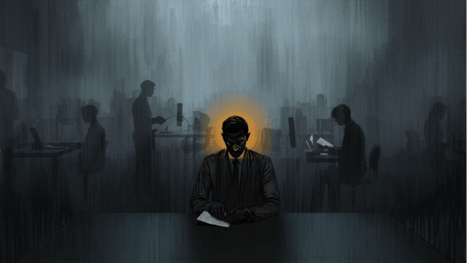
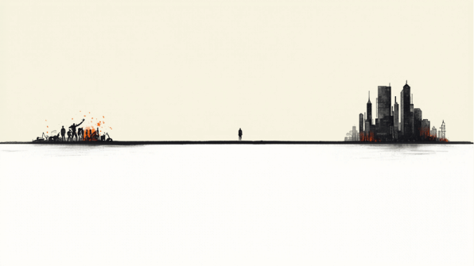
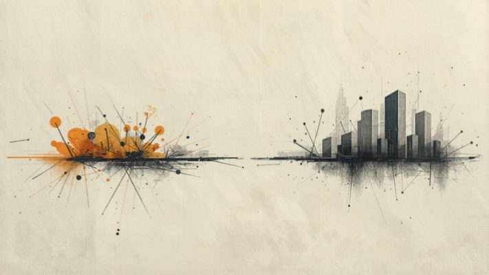
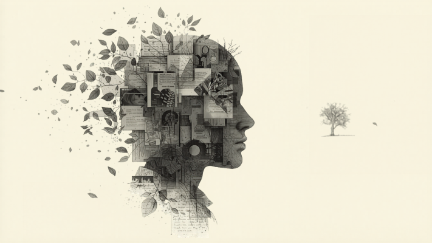
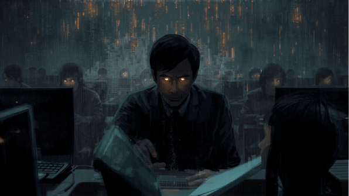
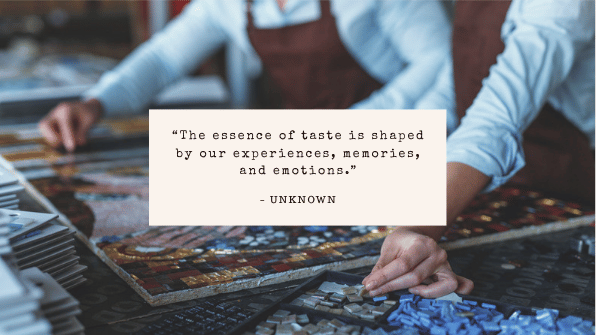
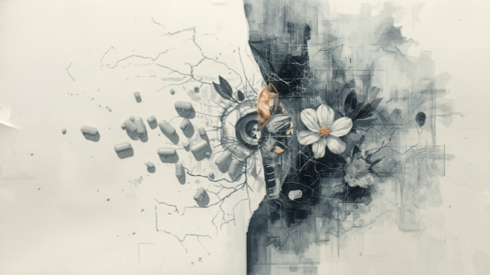

# 未来三年，世界会变什么，不会变什么？

> 发布时间：2026 年 4 月

如果只看最近几个月的新闻，很容易生出一种幻觉：世界仿佛每天都在换底层。新模型、新产品、新 Agent、新融资，一波接一波，热闹得像时代已经完成了交接。

但真正值得写下来的，往往不是热闹，而是热闹下面那条更硬的线。

真正那条更硬的线是：

**未来三年到五年，先被重写的，不是世界表面，而是“什么东西还稀缺”。**

过去很多岗位之所以值钱，不是因为它们神圣，而是因为它们稀缺。会写程序很稀缺，会做文档很稀缺，会整理信息很稀缺，会设计流程很稀缺，会做一个结构清晰的方案很稀缺，甚至“能把事情推进下去”本身也很稀缺。

现在，AI 正在吞掉这类稀缺。

所以这篇文章想说得直接一点：未来三年到五年，最大的变化不是“AI 更聪明了”，而是**大量高 AI 暴露度岗位会被重新定价，稀缺性会从执行层迁移到判断层、架构层、创意层，以及极少数真正掌握系统资源的人那里。**

接下来真正的问题才会浮出来：如果这些岗位不再稀缺，人会去哪里？社会会怎样重新分层？什么会变，什么不会变？

## 一、第一波先被冲击的，是高 AI 暴露度的白领岗位

如果把未来三年到五年压成一个判断，我会先押这里：

**最先承压的，不是低端体力劳动，而是高 AI 暴露度的办公室工作。**

原因并不复杂。AI 最容易切进去的，不是复杂的物理环境，而是信息环境。凡是主要工作内容是阅读、整理、改写、汇总、分析、协调、填表、写初稿、做方案、做文档、做跟进、做标准化沟通的岗位，天然更容易被 AI 侵蚀。

所以接下来先被重估的，往往会是这些角色：

- 初级程序员
- 办公室文员
- 行政助理
- 初级产品经理
- 初级运营
- 一部分客服与支持岗位
- 一部分财务、法务、咨询中的初级分析与文书岗位

这不是说这些岗位会一夜之间消失，也不是说所有人都会立刻失业。先消失的，通常不是岗位名字，而是岗位里那些曾经稀缺、如今越来越可以被机器完成的工作内容。

世界经济论坛在 2025 年 1 月 7 日发布的 [《Future of Jobs Report 2025》](https://www.weforum.org/publications/the-future-of-jobs-report-2025/in-full/2-jobs-outlook/) 里，已经把这个趋势说得很直白：到 2030 年，下降最快的岗位里就包括 clerical roles，也就是各种文员类、票务类、行政秘书类岗位，还包括 printing workers、accountants and auditors；报告甚至特别提到，Graphic Designers 和 Legal Secretaries 这类知识工作角色，也第一次明显出现在下行名单附近。它背后的主因，就是 digital access、AI and information processing technologies，以及 robots and autonomous systems 的扩张。

这里真正关键的是：**AI 不是只会冲击“低技能工作”，它往往先冲击那些高度依赖信息处理、却没有最终判断权的岗位。**

现实里的公司动作，已经足够说明问题。

2023 年 5 月 1 日，[IBM CEO Arvind Krishna](https://www.bloomberg.com/news/articles/2023-05-01/ibm-to-pause-hiring-for-back-office-jobs-that-ai-could-kill) 就公开表示，会暂停或放缓 back-office functions 的招聘，比如人力资源这类非客户-facing 的岗位。他当时给出的判断是，在 roughly 26,000 个这类岗位里，五年内大约 30% 可能会被 AI 和 automation 替代。

到了 2024 年 12 月 12 日，[Klarna CEO Sebastian Siemiatkowski 在 Bloomberg TV 上](https://www.bloomberg.com/news/articles/2024-12-12/klarna-stopped-all-hiring-a-year-ago-to-replace-workers-with-ai) 说，公司大约一年前就基本停止扩招了，员工人数从 4,500 降到 3,500，主要靠自然流失和不补招来完成收缩。他把这件事明确归因为 generative AI 带来的效率变化。

2025 年 4 月 7 日，[Shopify CEO Tobi Lutke](https://techcrunch.com/2025/04/07/shopify-ceo-tells-teams-to-consider-using-ai-before-growing-headcount/) 更进一步，直接要求团队在申请新增 headcount 之前，先证明为什么这件事不能用 AI 做掉。原话几乎就是：你要先说明，为什么你想要的结果不能通过 AI 完成。

同样在 2025 年 4 月 30 日，[Duolingo CEO Luis von Ahn 的公开 memo](https://techcrunch.com/2025/04/30/duolingo-launches-148-courses-created-with-ai-after-sharing-plans-to-replace-contractors-with-ai/) 里也明确写了：公司会逐步停止使用那些 AI 能处理掉的 contractor 工作，并且会把 AI 使用纳入招聘和绩效考量中。

这些例子不意味着“AI 已经完美取代人类”。它们真正说明的是：**企业已经开始把 AI 当作第一处理层，而不再只是辅助层。**

而一旦企业真正相信，AI 已经能自动化完成大部分“人本来能干的事”，人力一定会被精简掉。

这件事我不抱幻想。对工作内容做温柔调整，对组织做象征性优化，对裁员保持克制，这些话当然都可以说。但只要 AI 已经在账面上、流程上、速度上证明自己能替掉大部分重复劳动，headcount 被压缩几乎就是必然的。

这不是某个老板单纯地“更坏”，而是竞争结构会逼着企业这样做。你不精简，别人会；你不把 AI 当第一处理层，别人会；你还在用二十个人完成一件事，别人已经用五个人加一套智能系统完成了。最后替你做决定的，不是道德，而是市场。

在资本驱动和竞争结构面前，这几乎是必然结果。不要抱幻想。哪怕政府干预，也更可能只是延缓节奏，而很难真正逆转生产关系被改写这件事。

这会直接改写很多岗位的价值判断。

比如程序员。过去写一个程序要掌握很多知识：语法、框架、部署、调试、数据库、结构设计。每一样都构成门槛，所以“会写程序”本身就是稀缺的。今天不是这样了。代码生成、重构、补全、排错、读库文档，这些过去属于初级工程师的工作，正在快速商品化。

所以我对程序员的判断很明确：

- 初级程序员的价值会被大幅压缩
- 中间层会被持续挤压
- 真正还能保持高价值的，往往是两端

一端是最高级的架构师，能定义系统边界、技术路线、抽象层次、演进方式；另一端是富有创造力的创造者，能够提出新产品、新交互、新体验、新问题。中间那层“主要负责把明确需求实现出来”的位置，会越来越难受。

初级产品经理也类似。过去很多 PM 的核心能力，是写 PRD、整理需求、协调上下游、跟进进度、生成会议纪要、做竞品梳理、做方案初稿。这些工作当然还要有人做，但它们本身的稀缺性已经在迅速下降。未来稀缺的，不再是“会写文档的 PM”，而是“能看见真正问题、能做关键取舍、能守住产品审美与用户标准的人”。

## 二、稀缺性不会消失，它只会转移

很多人谈 AI，喜欢追问“哪些职业会消失”。但更准确的问题不是这个，而是：**稀缺性会转移到哪里去？**

过去稀缺的是“会做”。未来越来越稀缺的，是下面这些东西：

- 最高层的系统架构能力
- 真正的创造力
- 稳定的判断力
- 审美和品味
- 最终责任
- 对复杂上下文的整合能力

换句话说，AI 不是把价值打没了，而是把价值从执行层挤压到了更高层。

这也解释了为什么未来的分化会变得难看。

不是所有人都能自然地从执行层跳到创造层。大多数人过去的护城河，是经验积累出的熟练；但在 AI 时代，熟练本身会更快地被吸收、蒸馏、压缩。于是很多人会突然发现，自己花了很多年练出来的那套东西依然有用，却没那么值钱了。

这不是因为你没努力，而是因为时代把“稀缺”换了地方。

## 三、那么人会去干什么？未来大概率是一个杠铃型结构

接下来最难的问题不是“哪些工作被冲击”，而是“被冲击之后，人会往哪里走”。

我现在更相信一种杠铃型的未来。

一端，是越来越多的创作者、超级个体、微型团队、小型工作室。他们会借助 AI，把过去需要组织、团队、公司才能完成的事，重新拉回个人和小团体手里。一个人可能就是一个创意厂牌，一个三人小组就能做出过去三十人团队才能交付的产品、内容、工具或服务。

另一端，是超大型企业、超大型平台、超大型基础设施组织。数据、能源、算力、分发、支付、信任体系，这些东西不会天然去中心化，反而很可能继续向上游集中。未来很多普通人虽然可以调用智能，但真正能大规模调动系统级资源的，仍然还是那些掌握基础设施的大组织。

中间那一大块，会被挤压。

这就是我说的杠铃型。不是所有人都会变成自由创作者，也不是所有人都会进入巨头体系，但未来更稳的机会，很可能越来越集中在这两端：要么你足够有创造力，能借助 AI 做出自己的东西；要么你进入超大型组织，为它们服务、与它们共生，成为巨大系统中的关键节点。

这并不浪漫，但更接近现实。

从历史上看，每一次大规模技术进步都会把人从旧岗位里赶出来，再逼进新的岗位、新的组织形式和新的价值结构。长期看，人当然可能会转向更多创造性的工作，转向更多与判断、审美、体验、关系和新需求有关的工作。

问题在于，这个“长期”不会自动、也不会温柔地到来。

我们现在大概率就处在那个过渡期里：旧的稀缺性正在崩，新的人类锚点却还没有长出来。于是很多人会暂时悬空。他们不会立刻成为创作者，不会立刻成为架构师，更不会立刻找到自己在新世界里的位置。

这恰恰是当下最危险的地方。

## 四、如果新的锚点迟迟长不出来，悲观版本就会出现

乐观版本当然存在。它指向一种可能：人类被从大量重复、琐碎、标准化的信息劳动里推出来，最终转向更有创造性的工作，转向更多真正属于人的东西。

但悲观版本也必须被写下来。

悲观版本是：如果人始终找不到新的锚点，或者说新的社会分工根本无法以足够快的速度吸纳被挤出来的人，那么未来就不只是职业重估，而会变成更深的社会问题。那时人可能不是转向创造，而是转向无所适从。

尤瓦尔·赫拉利在《未来简史》里谈过一个很刺眼的词：**“无用阶级”**。我不觉得这个词一定会原封不动地变成现实，但它至少指出了一个方向性的风险：如果系统越来越不再需要大规模人类劳动，而新的意义结构、分配结构和社会角色又没有及时建立出来，那么相当一部分人会面临的，不只是失业，而是“我还有什么用”的问题。

再往下推一步，这种风险终究会把 UBI 之类的议题推上桌面。不是因为 UBI 听起来先进，而是因为当大量人被结构性地挤出旧经济之后，社会总要回答两个问题：

- 他们靠什么活下去？
- 他们靠什么继续相信自己活着是有意义的？

前一个问题是经济问题，后一个问题才更难。

## 五、不是所有岗位都会立刻危险，低 AI 暴露度的现实工作短期还相对安全

还有一件事需要说清楚：不要把 AI 的速度，直接错投到整个物理世界上。

在未来三年到五年里，我反而认为很多低 AI 暴露度、强现实环境、强身体执行、强即时服务的岗位，短期内还相对安全。比如：

- 厨师
- 外卖小哥
- 服务员
- 护工
- 保洁
- 建筑现场的一线工种

这不是说它们永远安全，而是说它们面对的不是纯信息环境，而是高摩擦、高不确定、高容错要求的物理环境。你要在真实厨房里做饭，在复杂道路上送餐，在拥挤的餐厅里端盘子，在充满突发情况的家庭和社区里照护他人，这不是“模型够聪明”就能立刻解决的。

具身智能当然会进步，但它没那么快。

一个很好的例子是 BMW。Figure 在 [《F.02 Contributed to the Production of 30,000 Cars at BMW》](https://www.figure.ai/news/production-at-bmw) 里回顾了他们在美国 Spartanburg 工厂的试点：Figure 02 在十个月里参与了超过 30,000 辆 BMW X3 的生产，五天一周、每天十小时，负责的是把 sheet metal parts 取放到焊接位置这样高度重复、边界清晰、毫米级精度的任务。与此同时，BMW PressClub 也能看到 [Spartanburg 工厂 2026 年的相关现场资料](https://www.press.bmwgroup.com/global/photo/detail/P90628880/Bodyshop-at-the-BMW-Group-Plant-Spartanburg-2026)；这些材料都说明，这类试点仍然高度集中在结构化、受控环境里。

这说明什么？

说明具身智能不是没来，而是它现在最容易切进去的，仍然是那些高度结构化、重复性强、环境受控的场景。离“让机器人三年内大规模顶掉厨师、外卖员、服务员”还有距离。至少在未来三到五年，这些岗位比办公室里那种纯信息流岗位更不容易被直接吞掉。

所以未来几年，我们大概率会同时看到一个很有意思的局面：

- 一部分坐办公室的人会先感受到地震
- 一部分现实服务岗位反而暂时更稳

这其实不反直觉。工业革命先改造的是大量体力劳动，如今开始轮到坐办公室的人；再往下一轮，黑灯工厂、具身智能继续推进，实体岗位也会被卷进来。只是顺序变了，不是方向变了。

## 六、问题不只是取代，而是生产力先变了，生产关系未必跟上

这也是我真正担心的地方。

很多人说，AI 提效以后，人自然就会轻松。我不完全信。

因为“提效”很多时候本身就是一个伪命题。真正的问题从来不是效率有没有提高，而是效率替谁提高，收益被谁拿走，代价又由谁承担。

因为生产力进步，不等于人立刻更轻松；决定劳动强度的，很多时候不是工具，而是生产关系。

如果一个组织原来要二十个人，现在只要五个人加若干 Agent，那多出来的收益会怎么分配？是大家一起更轻松，还是剩下的人承担更多工作、接受更高要求、被更高频地监控和考核？

现实里，后者往往更容易先发生。

所以未来三年，我们很可能看到的是：

- 生产力大幅提升
- 但个体疲惫感不降反升
- 价值优先被上游拿走
- 普通员工先感受到的是压强，不是自由

这也是为什么我一直不太相信“AI 会自动带来自由”的叙事。AI 当然可以解放人，但它同样也可以先成为压缩成本、加强管控、重构剥削方式的工具。

某种意义上，这也是一种杰文斯悖论：效率越高，未必越轻松，反而可能因为系统开始索取更多，而把人卷得更深。

所以真正的问题不是“AI 会不会提效”，而是：

**它提出来的效率，到底会被拿去解放人，还是继续榨人。**

## 七、未来的底层，不只是模型参数，而是数据、能源、信任

如果再往底层看，AI 时代真正的三个核心变量，不是某个模型今天又超了谁，而是：

- 数据
- 能源
- 信任

先说数据。

这里真正重要的，已经不再是公开数据。

公开互联网数据、开放语料、公开图片、公开代码，这些东西在过去几年里基本已经被训练得差不多了。它们当然依然有价值，但它们越来越难构成真正长期的壁垒。因为大家都能拿到，大家都能训，大家都能接近。

未来真正值钱的，会越来越是**私有数据**。

一个企业的内部流程数据、客户数据、历史决策数据、售后数据、供应链数据、知识库、销售记录、会议纪要；一个行业的隐性经验、案例库、交易流、失败样本、灰度规则；甚至一个组织内部那些无法被公开搜索引擎索引的上下文，都会变成宝贵的金矿。

谁拥有这些私有数据，谁就更容易把模型从“通用聪明”推进到“在这个具体世界里真正有用”。所以未来的数据，不再只是原料，而更像一个组织奠定差异化能力的基石。它决定你只能使用一个人人都能调用的平均模型，还是能把 AI 变成贴着自己业务与现实生长的系统。

现在越来越多的人，已经开始把企业知识浓缩成最近很流行的 `skill`。不管是把同事的方法论炼化成 skill，把企业知识炼化成 skill，还是把垂直领域的经验整理成 AI 能读懂的知识库，本质上都在做同一件事：把私有上下文翻译成机器可以调用的结构。

像 Notion 的 Think Together，本质上也是同一条线：不是单纯让模型更会回答，而是让团队知识、协作语境和组织记忆真正进入 AI 的上下文。

再说能源。

能源和算力，其实可以放在一起看。

因为算力背后终究是电，是数据中心，是芯片，是带宽，是冷却，是一整套基础设施。到今天，这已经越来越不像一个单纯的技术问题，而更像一个基础设施问题，甚至一个政治经济问题。

谁来建设？谁来掌控？谁来定价？谁能调用？谁被排除在外？

这些问题未来只会越来越尖锐。

也正因为如此，能源和算力的核心不只是“够不够”，而是“该不该长期被少数大型寡头垄断”。如果 AI 最终像电力、铁路、互联网骨干网一样成为时代底座，那它究竟应该是纯粹的私有租赁品，还是某种更接近公共基础设施的东西，这会是一个越来越无法回避的问题。

没有稳定便宜的能源和算力，很多 AI 叙事都是空中楼阁；但如果它们完全掌握在少数上游手里，时代的红利也会更进一步地向上聚拢。

最后是信任。

信任不是一句抽象的口号。很多时候，它就是最后那道你敢不敢押上结果的背书。

比如你去打官司。你当然可以问 AI，甚至 AI 可能会给你一份结构清楚、逻辑完整、引经据典的分析。但到了真正关键的时候，你还是会想找一个你认为足够牛、足够稳、足够见过世面的律师。那个律师给你的，不只是信息，而是一种你愿意把自己命运押上去的信任。

这就是信任的价值。

很多高价值服务，最后交付的根本不只是知识本身，而是“我愿意为这个结果负责”的那一层背书。未来也是一样。AI 创业、AI 服务、AI 产品，表面上都在比模型、比流程、比速度，最后却会收敛到一个更朴素的问题：

**谁能交付一种让别人敢于相信的结果感？**

这其实交付的不是功能，而是信任感。

所以未来的商业、协作、支付、平台、社区、组织，本质上都会越来越围绕“信任基础设施”来重建。谁能建立可信身份、可信关系、可信支付、可信分发，谁就会站在很深的上游。而那些只会给出“平均正确答案”、却无法承担后果的系统，长期看会有天然的天花板。

## 八、还有一个第四变量：emotion

严格说，这不完全是 AI 的核心变量，但它会越来越成为人类自己的核心变量。

当数据、能源、算力、流程、内容、代码越来越工业化以后，人和人之间的情感、关系、真实体验，反而会更稀缺。

我不相信一种未来：每个人只是高效地产出、调用 AI、完成闭环、独自生存。这样的未来太危险，也太贫瘠。我们不是为了成为一个个高效率的 pieces 才活着的。人类之所以是人类，本来就因为我们能在关系里交换思想、激发灵感、共同创造，并在彼此的情感中确认自己的存在。

所以未来真正不会消失的，恰恰是那些最像“无用之物”的东西：

- 爱
- 友谊
- 真实体验
- 共同创作
- 被另一个真实的人理解

它们在工业逻辑里看起来不够高效，但在 AI 时代，反而可能越来越贵。

## 九、还有一个会越来越贵的东西：品味

我还想单独补一个词：**品味**。

很多人会低估它的重要性，因为品味看起来太虚，不像数据、能源、信任那样硬，也不像代码、产品、组织那样容易被写进 KPI。

但我相信，品味恰恰会成为 AI 时代最稀缺的能力之一。

为什么？

因为品味不是知识点，也不是可以速成的技巧。品味是人在生活、创作、生产之中，被各种各样的事物长期冲刷之后，慢慢长出来的坐标系。你接触过什么，热爱过什么，厌恶过什么，被什么真正打动过，被什么伤害过，看过哪些有用之物，也看过哪些“无用之物”，这些都会在你身上留下痕迹，最后汇成一种判断。

这种判断，不只是“你喜欢什么风格”，而是：

- 你知道什么地方绝对不能去
- 你知道什么东西虽然流行但很糟糕
- 你知道什么看起来不起眼却有真正的生命力
- 你知道什么值得坚持，什么只是平均化噪音

这才是品味。

而现在的 AI 模型，虽然训练了海量数据，见过各种各样的文本、图片、代码、音乐和人类痕迹，但它天然有一个问题：**它更像是一个人类平均结果，而不是一个真正独特的存在。**

它当然可以拟合风格，可以模仿审美，可以学习偏好，可以在很多任务上表现得“很懂”。但它的默认中心，很多时候依然更接近平均值，更接近大规模数据标注、用户反馈和主流分布共同塑造出来的 average taste。

说得不客气一点，在很多场景下，这种平均品味并不高明。

它安全、平滑、正确、通用、不冒犯，但也因此缺少真正尖锐的判断，缺少真正独特的偏执，缺少那种“我知道为什么不要这个，却偏要那个”的力量。

所以未来真正稀缺的，不会只是“会不会创作”，而是：

- 你有没有自己的审美坐标
- 你能不能在平均化输出里识别出真正有生命力的东西
- 你能不能拿自己的生命经验，去校正模型那套平均化的 taste

未来很多高价值创造，表面上看是人在用 AI，实际上更像是：**一个有独特品味的人，在用自己的生命经验给模型校准方向。**

这也是为什么我一直不觉得“人会完全被 AI 取代”是一个足够精确的说法。更准确的说法也许是：平均化的人会先被平均化的模型压缩，而那些真正有自己坐标的人，会变得更贵。

因为模型能给你平均答案，但很难给你真正独特的答案。那种 unique 的部分，很多时候恰恰来自一个人被人生反复冲刷过之后，身上留下来的不可替代之物。

## 十、最后，什么不变？

如果一定要问，变化这么大，到底什么不会变？

我的答案是这样的。

第一，唯一不变的，也许就是变化本身。

《周易》讲“穷则变，变则通，通则久”。时代不会停在任何一个稳定形态上。真正不断迁移的，是稀缺，是资源配置的位置，是结构中的上游与下游。今天掌握搜索入口的人，明天可能掌握 Agent 入口；今天掌握 SaaS 的人，明天可能掌握企业记忆和执行层；今天掌握支付的人，明天可能掌握 AI 时代的信任栈。

所以不变的，不是某种位置本身，而是位置总会被重写。

第二，现实世界仍然服从物理约束。

不要因为模型每个月都在进步，就以为所有岗位都会等比例被吞掉。软件世界的速度，不等于整个世界的速度。

第三，人依然需要意义，而不只是效率。

人不是 CPU。一个人真正需要的，不只是更快地完成任务，而是在关系、创造、尊严、认同和热爱中确认自己还活着。

## 结语：未来最重要的，不是更会用工具，而是别把自己变成工具

如果一定要把这篇文章压缩成一句话，那就是：

**未来三年到五年，先被重写的是高 AI 暴露度岗位的稀缺性；更长期真正决定世界走向的，是稀缺性转移到哪里、价值被谁拿走，以及人能不能守住自己的主体性。**

所以我对未来的判断，既不是悲观，也不是盲目乐观。

真正值得警惕的，不是 AI 太强，而是人主动把自己交出去，最后把自己活成一个高效的外设。每天都在用工具，却慢慢失去判断力、失去品味、失去创造力、失去与他人共同生活和共同创作的能力。

未来不会长期奖励最忙的人。它更可能奖励那些既敢用 AI，又没有把自己灵魂外包出去的人。

所以真正该守住的，不只是职业竞争力，而是更深的几样东西：

- 判断力
- 架构能力
- 品味
- 创造力
- 真实信用
- 与他人协作和共创的能力

如果把这个问题再往更深处推，我会想到存在主义，尤其是萨特那条很有名的线索：**存在先于本质。**

它放到这里的意思并不复杂。未来世界不会先给你一个稳定角色，然后告诉你“你就是这个”。恰恰相反，很多旧角色会先被拆掉。于是人必须重新回答：如果岗位不能再定义我，效率不能再定义我，组织身份也不能再定义我，那我到底靠什么定义自己？

这个问题，没有任何模型能替你回答。

而这恰恰暴露出我们过去教育的缺口。我们过去的教育，更擅长训练人如何成为一个合格的、适配工业社会流程的执行体，却很少训练人如何在没有标准答案的世界里行动、判断、创造。应试需要标准答案，但真实世界没有标准答案。

所以我越来越确信，AI 时代最后会把很多人逼到一个极其古老的问题前面：你要自己选择自己的锚点，自己为自己的生命赋义。否则你就很容易滑进一种空心状态，既不真正被需要，也不真正知道自己为什么活着。

我也越来越确信这样一条区分：

未来机器会越来越接管小写的 `creation`，也就是那些可以复制、扩展、标准化的大量生产；但人如果还想保住自己的位置，就必须更认真地去追求大写的 `CREATION`，也就是提出新问题、定义新方向、创造新意义。

马斯克一直很喜欢《银河系漫游指南》里的“42”。这件事很有代表性。42 之所以迷人，不是因为它真的回答了一切，而是因为它提醒我们：人类总是渴望一个终极答案，渴望有人告诉你人生、宇宙与一切问题的标准解。但真正残酷的地方在于，很多时候答案并不是先在那里等你，而是你得先把“问题”活出来。

这背后其实还有他另一条判断：凭人类裸露的大脑，我们很可能根本不足以独自探索宇宙的终极秘密，所以我们才必须制造机器、制造智能，把自己的感知和理解向外延伸。不是为了逃离人，而是为了不坠入虚无主义。

而这里面还有一件可能真正属于人类、也真正昂贵的事情。

那就是：**人类敢于为那些并不确定的事情下注。**

不是因为看见了一个百分之百正确的答案，不是因为模型已经给出了最优解，不是因为风险被彻底消除了，而是因为你心里有某种相信，有某种热爱，有某种明知道未必成功、甚至知其不可而为之，也依然愿意往前走一步的勇气。

你会为了一个还没有被验证的新方向下注；会为了一个不被多数人理解的作品下注；会为了一个尚未被证明“值得”的关系下注；会为了一个还没有标准答案的人生下注。

这种下注，很多时候不是效率意义上的最优选择，却可能正是人之所以为人的根部。

因为模型擅长的是在既有空间里搜索更优解，而人类有时候会做的，是明明知道前面是迷雾，依然因为爱、因为信念、因为某种无法完全形式化的价值感，选择走进去。

这件事，可能正是人类独特之处，也可能是最昂贵的事情。

再往下走一步，我甚至会说，人类真正独特的地方，恰恰就在于：**人会生老病死。**

我们不是无限的，不是可回档的，不是永远可以重来的。正因为生命有终点，正因为人会衰老、会失去、会面对死亡，很多事情才第一次有了重量。

所以我越来越相信，真正的创造，从来不只是“生产新东西”，而是人类与虚无的搏斗。

它来源于对死亡的自觉，来源于对无常的反抗。换句话说，人类之所以创造，不是因为已经有答案，而是因为不能忍受没有答案；不是因为世界天然有意义，而是因为意识让我们既看见了无意义，又无法甘心放弃意义。

于是创造、行动、爱、思考，才会发生。

它们不是可有可无的装饰，而是人类对这种张力的回应。我们明明知道一切终将消散，知道生命没有一份被提前写好的说明书，知道很多问题也许永远没有终极解，但我们还是会去写、去做、去爱、去建立关系、去发明、去信仰、去追问、去创造。

某种意义上，连“上帝”这样的东西，也是在这种张力里被人创造出来的。不是因为答案先在那里，而是因为人无法长期承受彻底的虚无，于是不得不向虚无深处投出意义。

只要这种矛盾还存在，人类的创造性就不会消失。

而我甚至会说，这也许就是生命的第一因：不是确定，不是效率，不是最优解，而是在看见虚无之后，依然要为意义而活。

